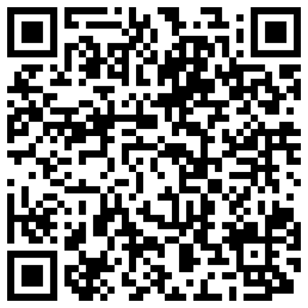
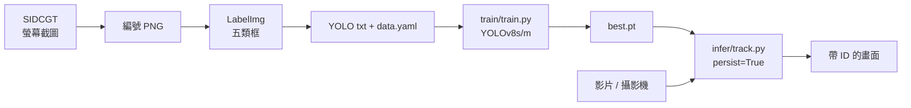

<p align="center">
  <a href="#readme"></a>
  <a href="docs/README.en.md"></a>
</p>

<p align="center">
  
</p>

<h1 align="center">Aircraft Tracking YOLOv8</h1>

<p align="center">
  <strong>自訂五類飛機偵測與影片追蹤</strong><br>
  截圖、標框、訓練、再把 ID 接到下一幀。<br>
  2023 碩士班深度學習的繳交作業，不是產品級偵測器。
</p>

<p align="center">
  
  
  
  
  
  
  
</p>

<p align="center">
  <a href="#功能">功能</a> ·
  <a href="#示範">示範</a> ·
  <a href="#架構">架構</a> ·
  <a href="#安裝">安裝</a> ·
  <a href="#專案結構">結構</a> ·
  <a href="#貢獻">貢獻</a> ·
  <a href="docs/README.md">文件索引</a> ·
  <a href="CHANGELOG.md">變更紀錄</a>
</p>

---

遠距的民航機、戰機、轟炸機、其他軍機與飛彈，在影片裡往往只佔幾十個像素。這個作業把課程原本的「人臉偵測 Colab」改成五類自訂資料：用小工具從螢幕抓幀、LabelImg 標 YOLO 框，再以 Ultralytics YOLOv8 做偵測，最後呼叫官方 `model.track()` 讓同一目標跨幀保持編號。

> **現況。** 這是民國 112（2023）碩士班深度學習的繳交成品，2026 年才收成可公開的展示倉。推論權重停在 `ats4.pt`（`my-yolov8s19`）。留下來最好的一份訓練日誌是 epoch 47 的 **mAP50 0.283**；missile 在另一次驗證幾乎是 0。數字照實寫，不美化。

## 功能

<table>
<tr>
<td width="33%" valign="top">

### 自己抓資料

`tools/sidcgt.py` 是當年的「螢幕畫面 data 蒐集神器」：Alt+Z 截一張、批量改名、轉 PNG/JPG、中心裁成正方形。展示倉只修了會讓程式不能用的兩處，按鈕與熱鍵不變。

</td>
<td width="33%" valign="top">

### 五類偵測

`civil_aircraft` / `fighter` / `bomber` / `other_military_aircraft` / `missile`。訓練腳本是 `train/train.py`，預設 YOLOv8s、640、50 epoch。2023 在 RTX 3070 上 batch 用到 25–27。

</td>
<td width="33%" valign="top">

### 影片追蹤

`infer/track.py` 對每一幀跑 `model.track(..., persist=True, conf=0.20)`，可選畫 30 點中心軌跡。沒有自訂追蹤器——就是 Ultralytics 內建的 BoT-SORT / ByteTrack。

</td>
</tr>
</table>

| 還有這些 | 為什麼這樣做 |
| --- | --- |
| **低置信度** | 目標很小、很遠。課堂示範把 `conf` 降到 0.20，寧可多抓、再靠人眼看軌跡。 |
| **課程模板沒刪光** | 原始 notebook 標題還是「人臉偵測」，`data.yaml` 裡留著 Roboflow face-detection 中繼資料。展示倉換成相對路徑，殘渣留在原料庫。 |
| **成績普通就寫普通** | 最好的 CSV 約 mAP50 0.28；另一次 val 全體 0.13、missile ≈ 0。這是小資料、YouTube 遠距目標的誠實結果。 |
| **原料不進 git** | 本機 `original-data/` 約 3.2 GB：原圖、權重、YouTube 測試片、LabelImg.exe。GitHub 不收這些。 |

## 示範

2023 課堂結果片用 QR 記在 [`docs/assets/demo-qr.png`](docs/assets/demo-qr.png)。測試 mp4（戰機、民航、B-52、綜合）只留在本機原料庫，**不上傳**。

<p align="center">
  
</p>
<p align="center"><sub>當年到課播放的結果片。片源是第三方 YouTube，本倉不鏡像影片。</sub></p>

### 一條完整路徑

```text
python tools/sidcgt.py          → 編號 PNG
        ↓
LabelImg（官方 repo，不內嵌 exe）
        ↓
YOLO txt + data/data.yaml
        ↓
python train/train.py --model yolov8s.pt
        ↓
python infer/track.py --weights runs/detect/aircraft-yolov8/weights/best.pt --source video.mp4 --trail
        ↓
視窗看框與 ID；按 q 離開
```

資料格式、訓練超參與追蹤坑見 [`docs/dataset.md`](docs/dataset.md)、[`docs/training.md`](docs/training.md)、[`docs/inference.md`](docs/inference.md)。

## 架構



四段都是獨立行程。沒有伺服器、沒有資料庫、沒有自訓追蹤頭。

| 層 | 位置 | 責任 |
| --- | --- | --- |
| 蒐集 | `tools/sidcgt.py` | 熱鍵截圖、改名、轉檔、裁方 |
| 設定 | `data/data.yaml` | 五類名稱與相對路徑 |
| 訓練 | `train/train.py`、`notebooks/train.ipynb` | Ultralytics `model.train` |
| 追蹤 | `infer/track.py`、`notebooks/track.ipynb` | `model.track` + 可選軌跡 |
| 說明 | `docs/` | 資料、訓練、推論、英文對照 |

<details>
<summary><strong>技術細節（可折疊）</strong></summary>

<br>

- 2023 環境：Python 3.10、PyTorch 2.1.1、CUDA 12.1、ultralytics 8.0.218、Windows、RTX 3070 8 GB。
- 訓練集 803 張／732 份標註；驗證 131 張。訓練框約 135 / 176 / 166 / 128 / 144（五類尚稱均衡）；驗證 missile 71 框，比其他類多一倍。
- `my-yolov8s19`（接續 s14、`imgsz=720`、50 epoch）最好一輪：P 0.285、R 0.344、mAP50 **0.283**、mAP50-95 0.194。CSV 在 [`docs/assets/metrics/my-yolov8s19-results.csv`](docs/assets/metrics/my-yolov8s19-results.csv)。
- notebook 另一次 `val`（run 名 `my-yolov8s162`，圖已刪）：全體 mAP50 0.13；missile mAP50 0.0026。
- 展示倉相對 2023 檔的偏離只有三處：刪掉重複的 `take_screenshot`、截圖迴圈改 `after()` 以免 Stop 按不到、追蹤在 `boxes.id is None` 時不要畫軌跡。
- 標註必須寫類別 **id**。原料庫有少數 txt 寫了英文類名或 `?`，訓練時要先清掉。
- Ultralytics 權重是 AGPL-3.0；本倉 MIT 只管自己的腳本與文件。

</details>

## 安裝

需要 Python 3.10+。有 NVIDIA GPU 會快很多；CPU 也能跑推論，只是課堂那種 720p 影片會頓。

### 1. 建立環境

```powershell
python -m venv .venv
.\.venv\Scripts\Activate.ps1
pip install -r requirements.txt
```

```bash
python -m venv .venv
source .venv/bin/activate
pip install -r requirements.txt
```

`ultralytics` 會在第一次訓練時下載官方 `yolov8s.pt`。不要把 `.pt` 推進 git。

### 2. 準備資料

把 YOLO 圖與標註放進 `data/images/{train,val}` 與 `data/labels/{train,val}`。本機若還有 2023 幀：

```powershell
# 僅本機實驗；那些圖有 YouTube 播放器 UI，請勿公開散布
New-Item -ItemType Directory -Force -Path data/images/train, data/images/val, data/labels/train, data/labels/val | Out-Null
Copy-Item original-data/aircraft_tracking_train_1/datasets_v1/train/images/* data/images/train/
Copy-Item original-data/aircraft_tracking_train_1/datasets_v1/valid/images/* data/images/val/
Copy-Item original-data/aircraft_tracking_train_1/datasets_v1/train/labels/* data/labels/train/
Copy-Item original-data/aircraft_tracking_train_1/datasets_v1/valid/labels/* data/labels/val/
```

### 3. 訓練與追蹤

```powershell
python train/train.py --model yolov8s.pt --epochs 50 --batch 16
python infer/track.py --weights runs/detect/aircraft-yolov8/weights/best.pt --source path\to\video.mp4 --trail
```

本機已有 2023 權重時：

```powershell
python infer/track.py --weights original-data/aircraft_tracking_use/pt/ats4.pt --source original-data/aircraft_tracking_use/test_mp4/fighter1.mp4 --conf 0.20
```

標框請用上游 [LabelImg](https://github.com/HumanSignal/labelImg)，不要重打包 `labelImg.exe`。

## 專案結構

```text
tools/sidcgt.py        截圖與轉檔小工具
train/train.py         訓練 CLI
infer/track.py         追蹤 CLI
data/data.yaml         五類設定（圖不進 git）
notebooks/             對應的薄 notebook
docs/                  說明與 Hero；英文在 README.en.md
LICENSE                MIT（只管本倉腳本與文件）
CONTRIBUTING.md        貢獻約定
CHANGELOG.md           Keep a Changelog 2.0.0
original-data/         約 3.2 GB 原料庫，已被 .gitignore
```

「為什麼沒把資料集／權重／影片放進來」見 [`docs/README.md`](docs/README.md)。

## 貢獻

這是封存的課程作業。歡迎修正文件、補環境註記、修展示腳本的明顯缺陷；請不要把 `original-data/`、YouTube 幀或 `.pt` 推進公開分支。細節在 [`CONTRIBUTING.md`](CONTRIBUTING.md)。

## 授權

程式與文件：[MIT](LICENSE)。2023 課程原作者；2026 年收成展示倉。

第三方 YouTube 畫面、測試片、官方 YOLO 權重與 LabelImg **不是**本授權範圍，也不在本倉裡。Ultralytics 請依其 AGPL-3.0 使用。

---

<p align="center">
  <sub>碩士班深度學習 · 民國 112 學年度 · 2023</sub>
</p>
