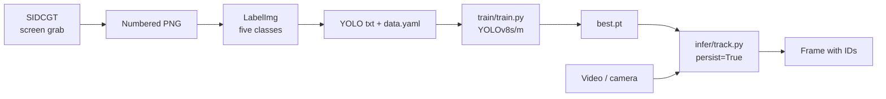

<p align="center">
  <a href="../README.md"></a>
  <a href="#readme"></a>
</p>

<p align="center">
  
</p>

<h1 align="center">Aircraft Tracking YOLOv8</h1>

<p align="center">
  <strong>A five-class aircraft detector with video tracking</strong><br>
  Capture a frame, draw a box, train, then keep the same ID on the next frame.<br>
  2023 master’s coursework in deep learning — not a product detector.
</p>

<p align="center">
  
  
  
  
  
  
  
</p>

<p align="center">
  <a href="#features">Features</a> ·
  <a href="#demo">Demo</a> ·
  <a href="#architecture">Architecture</a> ·
  <a href="#installation">Installation</a> ·
  <a href="#project-structure">Structure</a> ·
  <a href="#contributing">Contributing</a> ·
  <a href="./README.md">Docs index</a> ·
  <a href="../CHANGELOG.md">Changelog</a>
</p>

---

Civil airliners, fighters, bombers, other military types and missiles often occupy a few dozen pixels. This assignment took the course’s face-detection Colab and turned it into a custom five-class set: a small tool grabs frames from the screen, LabelImg writes YOLO boxes, Ultralytics YOLOv8 detects, and the official `model.track()` call keeps identities across frames.

English in this repository is **English**.

> **Status.** Submitted in academic year ROC 112 (2023); packaged for GitHub in 2026. Inference is frozen at `ats4.pt` (`my-yolov8s19`). The best remaining training log is **mAP50 0.283** at epoch 47. A later validation pass left missile at essentially zero. The numbers are left as measured.

## Features

<table>
<tr>
<td width="33%" valign="top">

### Collect your own frames

`tools/sidcgt.py` is the 2023 “screen-image data collection” utility: Alt+Z grabs a shot, then batch-rename, convert PNG/JPG, centre-crop to a square. The showcase tree only repairs two defects that stopped the tool working. Buttons and the hot-key are unchanged.

</td>
<td width="33%" valign="top">

### Five-class detection

`civil_aircraft` / `fighter` / `bomber` / `other_military_aircraft` / `missile`. `train/train.py` defaults to YOLOv8s, 640 px, 50 epochs. The 2023 RTX 3070 runs used batch 25–27.

</td>
<td width="33%" valign="top">

### Video tracking

`infer/track.py` calls `model.track(..., persist=True, conf=0.20)` on every frame and can draw a 30-point centre trail. There is no custom tracker — it is Ultralytics’ built-in BoT-SORT / ByteTrack.

</td>
</tr>
</table>

| Also | Why |
| --- | --- |
| **A low confidence floor** | Targets are small and distant. The classroom demo dropped `conf` to 0.20 and trusted the trail more than a high precision score. |
| **The course template was not cleaned** | The original notebook is still titled “face detection”; `data.yaml` still carried Roboflow face-detection metadata. This tree uses relative paths; the residue stays in the dump. |
| **Modest scores, written as modest** | Best CSV ≈ mAP50 0.28; another val pass was 0.13 overall, missile ≈ 0. That is an honest small-data, long-range YouTube result. |
| **The dump stays off git** | Local `original-data/` is about 3.2 GB: raw frames, weights, YouTube clips, LabelImg.exe. GitHub will not take them. |

## Demo

The 2023 result film was stored as a QR at [`assets/demo-qr.png`](assets/demo-qr.png). The test mp4s (fighter, civil, B-52, mixed) remain in the local dump and are **not** uploaded.

<p align="center">
  
</p>
<p align="center"><sub>The clip shown in class. The footage is third-party YouTube; this repository does not mirror it.</sub></p>

### One full path

```text
python tools/sidcgt.py          → numbered PNGs
        ↓
LabelImg (upstream repo; no bundled exe)
        ↓
YOLO txt + data/data.yaml
        ↓
python train/train.py --model yolov8s.pt
        ↓
python infer/track.py --weights runs/detect/aircraft-yolov8/weights/best.pt --source video.mp4 --trail
        ↓
Watch boxes and IDs; press q
```

Formats, hyperparameters and tracking pitfalls: [`dataset.md`](dataset.md), [`training.md`](training.md), [`inference.md`](inference.md).

## Architecture



Four separate processes. No server, no database, no trained tracking head.

| Layer | Path | Job |
| --- | --- | --- |
| Collect | `tools/sidcgt.py` | Hot-key grab, rename, convert, square crop |
| Config | `data/data.yaml` | Class names and relative paths |
| Train | `train/train.py`, `notebooks/train.ipynb` | Ultralytics `model.train` |
| Track | `infer/track.py`, `notebooks/track.ipynb` | `model.track` + optional trail |
| Docs | `docs/` | Dataset, training, inference, this tour |

<details>
<summary><strong>Technical notes (collapsed)</strong></summary>

<br>

- 2023 environment: Python 3.10, PyTorch 2.1.1, CUDA 12.1, ultralytics 8.0.218, Windows, RTX 3070 8 GB.
- Train set 803 images / 732 label files; val 131 images. Train boxes ≈ 135 / 176 / 166 / 128 / 144. Val is missile-heavy (71 boxes).
- `my-yolov8s19` (resume from s14, `imgsz=720`, 50 epochs) best epoch: P 0.285, R 0.344, mAP50 **0.283**, mAP50-95 0.194. CSV: [`assets/metrics/my-yolov8s19-results.csv`](assets/metrics/my-yolov8s19-results.csv).
- A notebook `val` (`my-yolov8s162`, plots deleted): overall mAP50 0.13; missile mAP50 0.0026.
- Showcase drift from the 2023 files is three lines of behaviour: drop the duplicate `take_screenshot`, poll Alt+Z with `after()` so Stop works, and skip the trail when `boxes.id` is `None`.
- Labels must be class **ids**. A few dump files wrote English names or `?`.
- Ultralytics weights are AGPL-3.0; the MIT grant here covers only this repository’s scripts and docs.

</details>

## Installation

Python 3.10+. An NVIDIA GPU helps; CPU inference will crawl on 720p classroom clips.

### 1. Environment

```powershell
python -m venv .venv
.\.venv\Scripts\Activate.ps1
pip install -r requirements.txt
```

```bash
python -m venv .venv
source .venv/bin/activate
pip install -r requirements.txt
```

`ultralytics` downloads official `yolov8s.pt` on the first train. Do not commit `.pt` files.

### 2. Data

Place YOLO images and labels under `data/images/{train,val}` and `data/labels/{train,val}`. If the 2023 frames are still on disk:

```powershell
# Local experiment only — those frames include YouTube chrome; do not redistribute
New-Item -ItemType Directory -Force -Path data/images/train, data/images/val, data/labels/train, data/labels/val | Out-Null
Copy-Item original-data/aircraft_tracking_train_1/datasets_v1/train/images/* data/images/train/
Copy-Item original-data/aircraft_tracking_train_1/datasets_v1/valid/images/* data/images/val/
Copy-Item original-data/aircraft_tracking_train_1/datasets_v1/train/labels/* data/labels/train/
Copy-Item original-data/aircraft_tracking_train_1/datasets_v1/valid/labels/* data/labels/val/
```

### 3. Train and track

```powershell
python train/train.py --model yolov8s.pt --epochs 50 --batch 16
python infer/track.py --weights runs/detect/aircraft-yolov8/weights/best.pt --source path\to\video.mp4 --trail
```

With the 2023 weights still local:

```powershell
python infer/track.py --weights original-data/aircraft_tracking_use/pt/ats4.pt --source original-data/aircraft_tracking_use/test_mp4/fighter1.mp4 --conf 0.20
```

For boxes, use upstream [LabelImg](https://github.com/HumanSignal/labelImg). Do not re-bundle `labelImg.exe`.

## Project structure

```text
tools/sidcgt.py        Screenshot and convert utility
train/train.py         Training CLI
infer/track.py         Tracking CLI
data/data.yaml         Five-class config (images not in git)
notebooks/             Thin notebooks for the same scripts
docs/                  Notes and hero; this file is the English tour
LICENSE                MIT (scripts and docs in this tree only)
CONTRIBUTING.md        How to send a change
CHANGELOG.md           Keep a Changelog 2.0.0
original-data/         ~3.2 GB working dump; gitignored
```

Why the dataset, weights and films stay out: [`README.md`](README.md).

## Contributing

This is archived coursework. Documentation fixes, environment notes and obvious showcase-script defects are welcome. Do not push `original-data/`, YouTube frames or `.pt` files to a public branch. See [`../CONTRIBUTING.md`](../CONTRIBUTING.md) and [`CONTRIBUTING.en.md`](CONTRIBUTING.en.md).

## Licence

Code and docs: [MIT](../LICENSE). Original 2023 coursework author; packaged in 2026.

Third-party YouTube frames, test films, official YOLO checkpoints and LabelImg are **not** under that grant and are not in this tree. Use Ultralytics under AGPL-3.0.

---

<p align="center">
  <sub>Master’s deep learning · academic year ROC 112 · 2023</sub>
</p>
